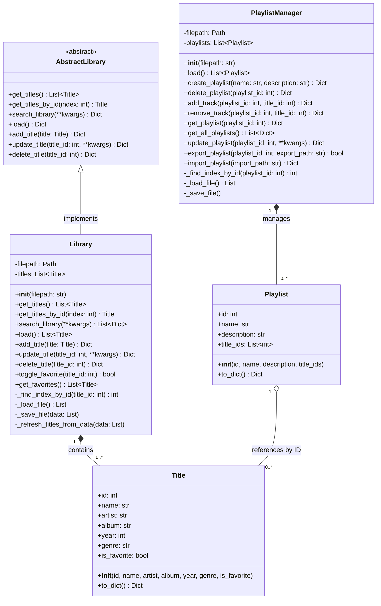
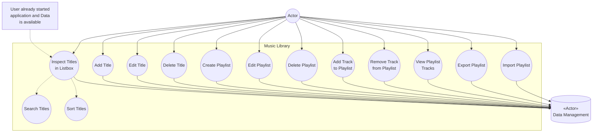

# Musik Bibliothek 

Im Rahmen der Vorlesung Software Technik soll eine Musik Bibliothek erstellt werden. Diese soll durch agile Methoden wie User Stories und einen Backlog getrackt werden. Es sollen Test verfasst werden und UML-Diagramme erstellt werden.

---

## Inhaltsverzeichnis

- [Musik Bibliothek](#musik-bibliothek)
  - [Inhaltsverzeichnis](#inhaltsverzeichnis)
  - [Über das Projekt](#über-das-projekt)
  - [Autoren und Betreuung](#autoren-und-betreuung)
  - [Technologien und Tools](#technologien-und-tools)
  - [KI-Nutzung](#ki-nutzung)
  - [Tool-Nutzung](#tool-nutzung)
  - [Installation und Ausführung](#installation-und-ausführung)
  - [Projektstruktur](#projektstruktur)
    - [Klassendiagramm](#klassendiagramm)
    - [Sequenzdiagramme](#sequenzdiagramme)
      - [1. Hinzufügen eines Titels](#1-hinzufügen-eines-titels)
      - [2. Aktualisieren eines Titels](#2-aktualisieren-eines-titels)
      - [3. Löschen eines Titels](#3-löschen-eines-titels)
      - [4. Suchen eines Titels](#4-suchen-eines-titels)
      - [5. Playlist anlegen](#5-playlist-anlegen)
      - [6. Playlist exportieren](#6-playlist-exportieren)
      - [7. Playlist importieren](#7-playlist-importieren)
    - [Use Case Diagramm](#use-case-diagramm)
  - [Use Case Beschreibungen](#use-case-beschreibungen)

 ---

## Über das Projekt

Dieses Projekt wurde im Rahmen des Moduls Software Technik im Wintersemester 2025/26 an der Hochschule Esslingen entwickelt. Ziel ist die Entwicklung einer Musik Bibliothek. Diese soll durch agile Methoden wie User Stories und einen Backlog getrackt werden. Es sollen Test verfasst werden und UML-Diagramme erstellt werden.

---

## Autoren und Betreuung

Marvin Calmer, Gregor Ruehle, Dustin-Thai Tran, Paul Ellinger

Betreuung: Prof. Dr. Martin Roehricht

---

## Technologien und Tools

Liste der wichtigsten verwendeten Technologien, Frameworks und Tools:

- Programmiersprache: Python
- Frameworks: Pytest
- Datenspeicherung: JSON
- Tools: Git, Visual Studio Code, ChatGPT, CoPilot, Draw.io, Ruff

---

## KI-Nutzung
Im Rahmen des Projekts wurden KI-Tools wie ChatGPT und CoPilot genutzt. Vorwiegend für die Dokumentation und Autocomplete von Codezeilen. 

---

## Tool-Nutzung
Im Rahmen des Projekts wurden das Tool Ruff zur Formatierung und Linting des Codes genutzt.

---

## Installation und Ausführung

```bash
# Repository klonen
git clone https://github.com/MarvinCalmer/SWE_Project_MusicLibrary

# pytest installieren
make install

# Projekt starten
make run

# Standard-Test
make test

# Tests mit verbose output
make test-v

# Tests mit detailliertem output und fehlgeschlagenen zuerst
make test-vv

# Tests mit Coverage-Report
make test-cov

# Tests mit HTML Coverage-Report
make test-cov-html

# Aufräumen
make clean
```

---

## Projektstruktur

```bash

MusicLibrary/
│
├── docs/                     # Diagramme, Use Cases, Dokumentation
│   ├── usecases.md           # Detaillierte Use Case Beschreibungen
│   └── images/               # Exportierte Diagrammbilder (PNG/SVG)
│
├── src/                      # Quellcode der Musik Bibliothek
│   ├── core/                 # Kernlogik / Business Layer
│   │   ├── library.py        # Library Klasse
│   │   ├── playlist_manager.py        # Playlist Manager Klasse
│   │   ├── playlist.py        # Playlist Klasse
│   │   ├── title.py          # Title Klasse
│   │   └── abstract_library.py # Basisklasse für Library
│   └── gui/                  # GUI
├── data/                     # Datensätze oder Input-Dateien
│   └── library.json          # library data
│   └── playlists.json        # Playlist data
│
├── tests/                    # Unit Tests
│
├── Makefile                  # Makefile zum Installieren, Starten, Testen, Aufräumen
└── README.md                 # Projektbeschreibung, Installation, UML-Diagramme, Use Cases
     

```

### Klassendiagramm



*Beschreibung:*  
- `Library` verwaltet eine Sammlung von `Title`-Objekten.  
- `AbstractLibrary` ist die abstrakte Basisklasse.  
- `Title` enthält Attribute wie `id`, `name`, `artist`, etc.  
- `PlaylistManager` verwaltet eine Sammlung von `Playlist`-Objekten.
- `Playlist` enthält Referenzen zu `Title`-Objekten über `title_ids`.
- Methoden zur Suche, Hinzufügen, Aktualisierung und Löschung sind in `Library` und `PlaylistManager` implementiert.

---

### Sequenzdiagramme

#### 1. Hinzufügen eines Titels


*Beschreibung:*  
- Benutzer gibt Daten für einen neuen Titel ein.  
- GUI erstellt ein `Title`-Objekt und ruft `Library.add_title` auf.  
- `Library` vergibt eine neue ID, speichert den Titel in der JSON-Datei und der Titelliste und gibt die aktualisierte Liste zurück.  

#### 2. Aktualisieren eines Titels


*Beschreibung:*  
- Benutzer wählt einen vorhandenen Titel aus.  
- GUI ruft `Library.update_title` mit den geänderten Attributen auf.  
- `Library` aktualisiert das Title-Objekt und speichert die Änderungen in der JSON-Datei und der Titelliste.  

#### 3. Löschen eines Titels


*Beschreibung:*  
- Benutzer wählt einen Titel zum Löschen aus.  
- GUI ruft `Library.delete_title` auf.  
- `Library` entfernt den Titel aus der JSON-Datei und der Titelliste und gibt die aktualisierte Liste zurück.

#### 4. Suchen eines Titels


*Beschreibung:*  
- Benutzer gibt einen Suchbegriff ein.
- GUI ruft `Library.search_library` auf.  
- `Library` filtert die Titel, sortiert die Ergebnisse und gibt sie an die GUI zurück.  
- GUI zeigt die Treffer in der Listbox an oder zeigt eine Info-Box, wenn keine Treffer gefunden werden.

#### 5. Playlist anlegen

```mermaid
sequenceDiagram
    participant User
    participant GUI
    participant create_playlist() as create_playlist()
    participant DialogBox
    participant PlaylistManager
    participant Playlist as Playlist-Objekt
    participant JSON as playlists.json

    User->>GUI: klickt "Create Playlist"
    GUI->>create_playlist(): create_playlist()
    
    create_playlist()->>DialogBox: askstring("Playlist Name")
    DialogBox-->>create_playlist(): name
    
    create_playlist()->>DialogBox: askstring("Beschreibung")
    DialogBox-->>create_playlist(): description
    
    create_playlist()->>PlaylistManager: create_playlist(name, description)
    
    PlaylistManager->>Playlist: new Playlist(name, description)
    Playlist-->>PlaylistManager: playlist object
    
    PlaylistManager->>PlaylistManager: Berechne nächste ID
    Note over PlaylistManager: ID = max(existing IDs) + 1<br/>oder 1 wenn keine existieren
    
    PlaylistManager->>Playlist: playlist.id = calculated_id
    PlaylistManager->>PlaylistManager: playlists.append(playlist)
    
    PlaylistManager->>PlaylistManager: _save_file()
    PlaylistManager->>Playlist: to_dict()
    Playlist-->>PlaylistManager: playlist_dict
    PlaylistManager->>JSON: json.dump(playlists_data)
    JSON-->>PlaylistManager: Erfolg
    
    PlaylistManager-->>create_playlist(): playlist_dict
    create_playlist()->>GUI: refresh_playlist_listbox()
    create_playlist()-->>User: Bestätigung
```

*Beschreibung:*  
- Benutzer erstellt eine neue Playlist mit Namen und Beschreibung.
- GUI ruft `PlaylistManager.create_playlist` auf.
- `PlaylistManager` erstellt ein neues `Playlist`-Objekt und vergibt automatisch eine ID.
- Die Playlist wird zur Playlist-Liste hinzugefügt und in der JSON-Datei gespeichert.
- GUI erhält die Bestätigung mit den Playlist-Details.

#### 6. Playlist exportieren

```mermaid
sequenceDiagram
    participant User
    participant GUI
    participant export_playlist() as export_playlist()
    participant playlist_listbox
    participant PlaylistManager
    participant Playlist as Playlist-Objekt
    participant ExportFile as Export JSON File

    User->>GUI: klickt "Export Playlist"
    GUI->>export_playlist(): export_playlist()
    
    export_playlist()->>playlist_listbox: curselection()
    playlist_listbox-->>export_playlist(): index
    
    alt keine Auswahl
        export_playlist()->>GUI: messagebox.showwarning("Bitte auswählen")
        GUI-->>User: Warnung
    else Auswahl vorhanden
        export_playlist()->>GUI: filedialog.asksaveasfilename()
        GUI-->>export_playlist(): export_path
        
        export_playlist()->>PlaylistManager: export_playlist(playlist_id, export_path)
        
        PlaylistManager->>PlaylistManager: _find_index_by_id(playlist_id)
        
        alt Playlist gefunden
            PlaylistManager->>Playlist: playlists[index].to_dict()
            Playlist-->>PlaylistManager: playlist_data
            
            PlaylistManager->>ExportFile: open(export_path, "w")
            activate ExportFile
            PlaylistManager->>ExportFile: json.dump(playlist_data)
            ExportFile-->>PlaylistManager: Erfolg
            deactivate ExportFile
            
            PlaylistManager-->>export_playlist(): True
            export_playlist()->>GUI: messagebox.showinfo("Export erfolgreich")
            GUI-->>User: Bestätigung
        else Playlist nicht gefunden
            PlaylistManager-->>export_playlist(): ValueError
            export_playlist()->>GUI: messagebox.showerror("Fehler")
            GUI-->>User: Fehler: Playlist nicht gefunden
        end
    end
```

*Beschreibung:*  
- Benutzer wählt eine Playlist zum Exportieren und gibt einen Dateipfad an.
- GUI ruft `PlaylistManager.export_playlist` auf.
- `PlaylistManager` sucht die Playlist anhand der ID.
- Bei erfolgreicher Suche werden die Playlist-Daten in eine separate JSON-Datei geschrieben.
- Bei Fehler wird eine ValueError-Exception geworfen.

#### 7. Playlist importieren

```mermaid
sequenceDiagram
    participant User
    participant GUI
    participant import_playlist() as import_playlist()
    participant ImportFile as Import JSON File
    participant PlaylistManager
    participant Playlist as Playlist-Objekt
    participant JSON as playlists.json

    User->>GUI: klickt "Import Playlist"
    GUI->>import_playlist(): import_playlist()
    
    import_playlist()->>GUI: filedialog.askopenfilename()
    GUI-->>import_playlist(): import_path
    
    import_playlist()->>PlaylistManager: import_playlist(import_path)
    
    alt Erfolgreicher Import
        PlaylistManager->>ImportFile: open(import_path, "r")
        activate ImportFile
        ImportFile->>ImportFile: json.load()
        ImportFile-->>PlaylistManager: playlist_data (JSON)
        deactivate ImportFile
        
        PlaylistManager->>PlaylistManager: Validiere playlist_data
        Note over PlaylistManager: Prüfe ob dict und Felder vorhanden
        
        PlaylistManager->>Playlist: new Playlist(name, description, title_ids)
        activate Playlist
        Playlist-->>PlaylistManager: playlist object
        deactivate Playlist
        
        PlaylistManager->>PlaylistManager: Berechne neue ID
        Note over PlaylistManager: ID = max(existing IDs) + 1 oder 1
        
        PlaylistManager->>Playlist: playlist.id = calculated_id
        PlaylistManager->>PlaylistManager: playlists.append(playlist)
        
        PlaylistManager->>PlaylistManager: _save_file()
        activate PlaylistManager
        Note over PlaylistManager: Speichert alle Playlists in playlists.json
        deactivate PlaylistManager
        
        PlaylistManager->>Playlist: to_dict()
        Playlist-->>PlaylistManager: playlist_dict
        PlaylistManager-->>import_playlist(): playlist_dict
        
        import_playlist()->>GUI: refresh_playlist_listbox()
        import_playlist()->>GUI: messagebox.showinfo("Import erfolgreich")
        GUI-->>User: Bestätigung
        
    else Datei nicht gefunden
        PlaylistManager->>ImportFile: open(import_path, "r")
        activate ImportFile
        ImportFile-->>PlaylistManager: FileNotFoundError
        deactivate ImportFile
        PlaylistManager-->>import_playlist(): ValueError
        import_playlist()->>GUI: messagebox.showerror("Datei nicht gefunden")
        GUI-->>User: Fehler
        
    else JSON ungültig
        PlaylistManager->>ImportFile: open(import_path, "r")
        activate ImportFile
        ImportFile->>ImportFile: json.load()
        ImportFile-->>PlaylistManager: JSONDecodeError
        deactivate ImportFile
        PlaylistManager-->>import_playlist(): ValueError
        import_playlist()->>GUI: messagebox.showerror("Ungültiges JSON")
        GUI-->>User: Fehler
        
    else Ungültige Daten
        PlaylistManager->>ImportFile: open(import_path, "r")
        activate ImportFile
        ImportFile->>ImportFile: json.load()
        ImportFile-->>PlaylistManager: playlist_data
        deactivate ImportFile
        PlaylistManager->>PlaylistManager: Validierung fehlgeschlagen
        PlaylistManager-->>import_playlist(): ValueError
        import_playlist()->>GUI: messagebox.showerror("Ungültiges Format")
        GUI-->>User: Fehler
    end
```

*Beschreibung:*  
- Benutzer wählt eine JSON-Datei zum Importieren aus.
- GUI ruft `PlaylistManager.import_playlist` auf.
- `PlaylistManager` liest und validiert die Datei.
- Bei gültigen Daten wird eine neue Playlist mit neuer ID erstellt und zur Sammlung hinzugefügt.
- Mögliche Fehler: Datei nicht gefunden, ungültiges JSON-Format, ungültige Datenstruktur.

---

### Use Case Diagramm



*Beschreibung:*  

Zeigt die wichtigsten Aktionen, die ein Benutzer durchführen kann:  

**Title Management:**
- Titel in Listbox inspizieren (inkl. Suchen und Sortieren)
- Titel hinzufügen  
- Titel bearbeiten  
- Titel löschen  

**Playlist Management:**
- Playlist erstellen
- Playlist bearbeiten
- Playlist löschen
- Track zu Playlist hinzufügen
- Track aus Playlist entfernen
- Playlist-Tracks anzeigen
- Playlist exportieren
- Playlist importieren

**Akteure und Beziehungen:**
- **Actor** initiiert alle Use Cases durch Interaktion mit der GUI
- **GUI** agiert als Schnittstelle zwischen Benutzer und Library/PlaylistManager
- **Data Management Actor** verwaltet das Laden und Speichern der Daten (library.json und playlists.json)
- **Include-Beziehungen**: "Inspect Titles" beinhaltet "Search Titles" und "Sort Titles"
- **Precondition**: User already started application and Data is available
---

## Use Case Beschreibungen
[Use Case Beschreibungen](/docs/usecases.md)