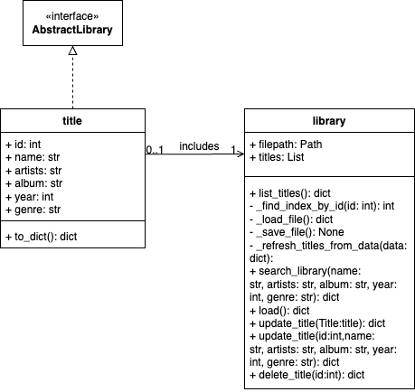
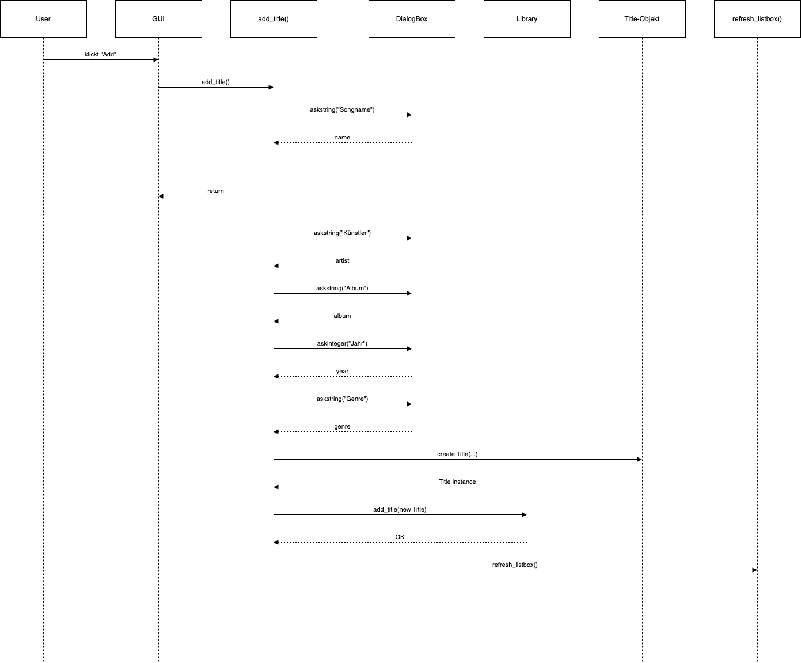
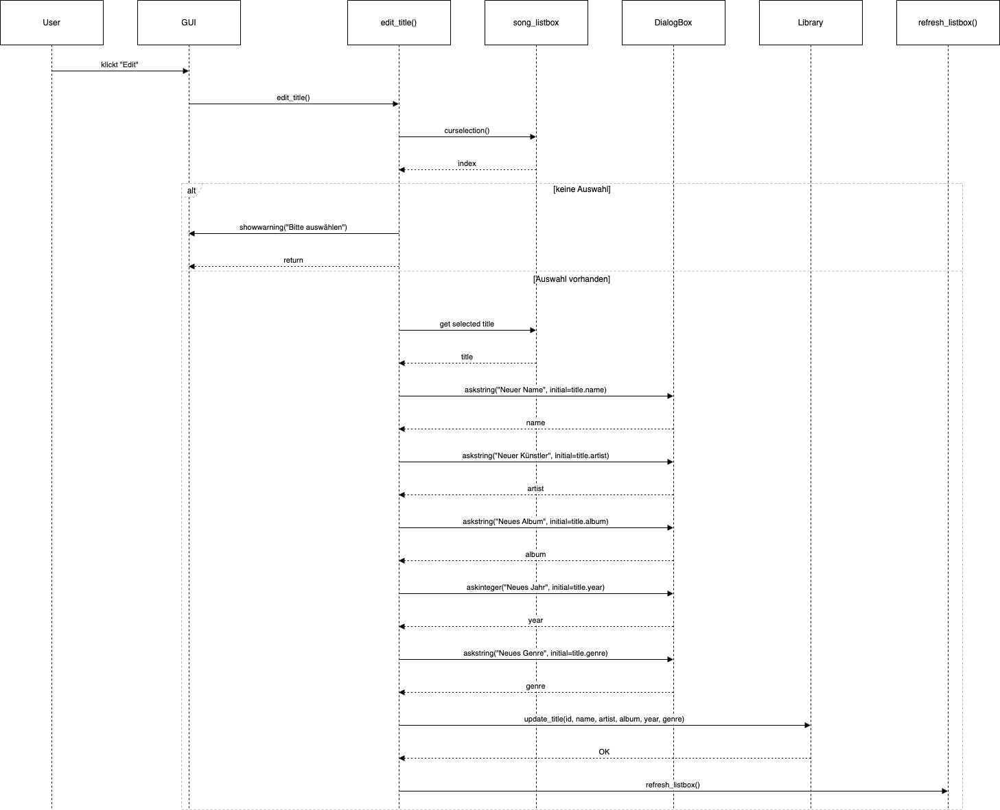
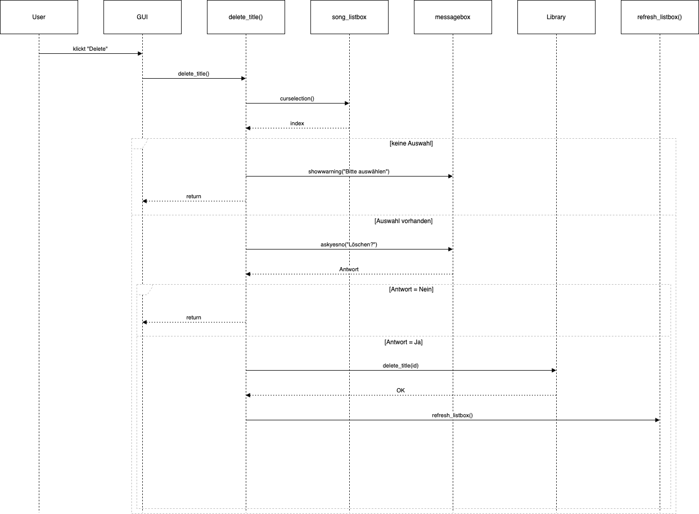
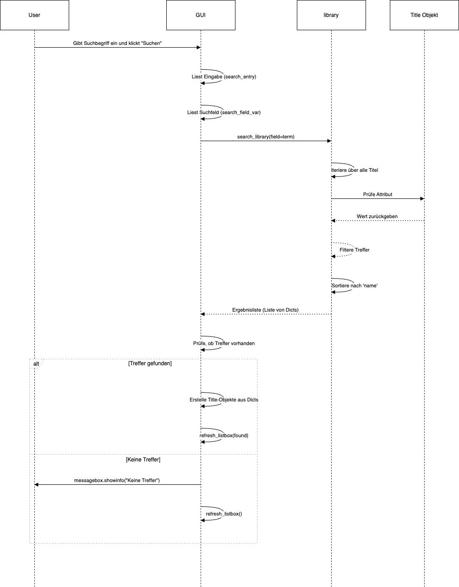
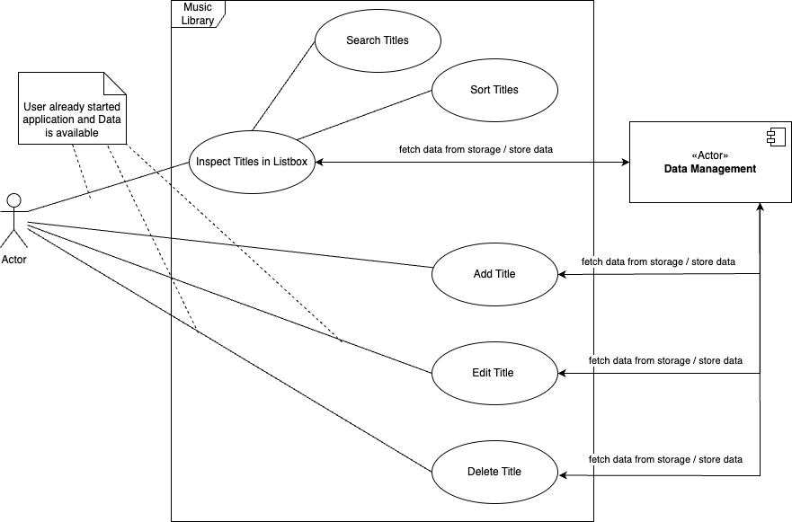

# Musik Bibliothek 

Im Rahmen der Vorlesung Software Technik soll eine Musik Bibliothek erstellt werden. Diese soll durch agile Methoden wie User Stories und einen Backlog getrackt werden. Es sollen Test verfasst werden und UML-Diagramme erstellt werden.

---

## Inhaltsverzeichnis

- [Musik Bibliothek](#musik-bibliothek)
  - [Inhaltsverzeichnis](#inhaltsverzeichnis)
  - [Über das Projekt](#über-das-projekt)
  - [Autoren und Betreuung](#autoren-und-betreuung)
  - [Technologien und Tools](#technologien-und-tools)
  - [KI-Nutzung](#ki-nutzung)
  - [Installation und Ausführung](#installation-und-ausführung)
  - [Projektstruktur](#projektstruktur)
  - [UML-Diagramme der Musik Bibliothek](#uml-diagramme-der-musik-bibliothek)
    - [Klassendiagramm](#klassendiagramm)
    - [Sequenzdiagramme](#sequenzdiagramme)
      - [1. Hinzufügen eines Titels](#1-hinzufügen-eines-titels)
      - [2. Aktualisieren eines Titels](#2-aktualisieren-eines-titels)
      - [3. Löschen eines Titels](#3-löschen-eines-titels)
      - [4. Suchen eines Titels](#4-suchen-eines-titels)
    - [Use Case Diagramm](#use-case-diagramm)
  - [Use Case Beschreibungen](#use-case-beschreibungen)

 ---

## Über das Projekt

Dieses Projekt wurde im Rahmen des Moduls Software Technik im Wintersemester 2025/26 an der Hochschule Esslingen entwickelt. Ziel ist die Entwicklung einer Musik Bibliothek. Diese soll durch agile Methoden wie User Stories und einen Backlog getrackt werden. Es sollen Test verfasst werden und UML-Diagramme erstellt werden.

---

## Autoren und Betreuung

Marvin Calmer, Gregor Ruehle, Dustin-Thai Tran, Paul Ellinger

Betreuung: Prof. Dr. Martin Roehricht

---

## Technologien und Tools

Liste der wichtigsten verwendeten Technologien, Frameworks und Tools:

- Programmiersprache: Python
- Frameworks: Pytest
- Datenspeicherung: JSON
- Tools: Git, Visual Studio Code, ChatGPT, CoPilot, Draw.io

---

## KI-Nutzung
Im Rahmen des Projekts wurden KI-Tools wie ChatGPT und CoPilot genutzt. Vorwiegend für die Dokumentation und Autocomplete von Codezeilen. 

---

## Installation und Ausführung

```bash
# Repository klonen
git clone https://github.com/MarvinCalmer/SWE_Project_MusicLibrary

# pytest installieren
make install

# Projekt starten
make run

# Standard-Test
make test

# Tests mit verbose output
make test-v

# Tests mit detailliertem output und fehlgeschlagenen zuerst
make test-vv

# Tests mit Coverage-Report
make test-cov

# Tests mit HTML Coverage-Report
make test-cov-html

# Aufräumen
make clean
```

---

## Projektstruktur

```bash

MusicLibrary/
│
├── docs/                     # Diagramme, Use Cases, Dokumentation
│   ├── usecases.md           # Detaillierte Use Case Beschreibungen
│   └── images/               # Exportierte Diagrammbilder (PNG/SVG)
│
├── src/                      # Quellcode der Musik Bibliothek
│   ├── core/                 # Kernlogik / Business Layer
│   │   ├── library.py        # Library Klasse
│   │   ├── title.py          # Title Klasse
│   │   └── abstract_library.py # Basisklasse für Library
│   └── gui/                  # GUI
├── data/                     # Datensätze oder Input-Dateien
│   └── library.json          # Beispiel-Daten zum Testen
│
├── tests/                    # Unit Tests
│   └── test_library.py       # Tests für Hilfsfunktionen
│
├── Makefile                  # Makefile zum Installieren, Starten, Testen, Aufräumen
└── README.md                 # Projektbeschreibung, Installation, UML-Diagramme, Use Cases
     

```

## UML-Diagramme der Musik Bibliothek

### Klassendiagramm



*Beschreibung:*  
- `Library` verwaltet eine Sammlung von `Title`-Objekten.  
- `AbstractLibrary` ist die abstrakte Basisklasse.  
- `Title` enthält Attribute wie `id`, `name`, `artist`, etc.  
- Methoden zur Suche, Hinzufügen, Aktualisierung und Löschung sind in `Library` implementiert.

---

### Sequenzdiagramme

#### 1. Hinzufügen eines Titels



*Beschreibung:*  
- Benutzer gibt Daten für einen neuen Titel ein.  
- GUI erstellt ein `Title`-Objekt und ruft `Library.add_title` auf.  
- `Library` vergibt eine neue ID, speichert den Titel in der JSON-Datei und der Titelliste und gibt die aktualisierte Liste zurück.  

#### 2. Aktualisieren eines Titels



*Beschreibung:*  
- Benutzer wählt einen vorhandenen Titel aus.  
- GUI ruft `Library.update_title` mit den geänderten Attributen auf.  
- `Library` aktualisiert das Title-Objekt und speichert die Änderungen in der JSON-Datei und der Titelliste.  

#### 3. Löschen eines Titels



*Beschreibung:*  
- Benutzer wählt einen Titel zum Löschen aus.  
- GUI ruft `Library.delete_title` auf.  
- `Library` entfernt den Titel aus der JSON-Datei und der Titelliste und gibt die aktualisierte Liste zurück.

#### 4. Suchen eines Titels



*Beschreibung:*  
- Benutzer gibt einen Suchbegriff ein.
- GUI ruft `Library.search_library` auf.  
- `Library` filtert die Titel, sortiert die Ergebnisse und gibt sie an die GUI zurück.  
- GUI zeigt die Treffer in der Listbox an oder zeigt eine Info-Box, wenn keine Treffer gefunden werden.

---

### Use Case Diagramm



*Beschreibung:*  
- Zeigt die wichtigsten Aktionen, die ein Benutzer durchführen kann:  
  - Titel suchen  
  - Titel hinzufügen  
  - Titel aktualisieren  
  - Titel löschen  
- GUI agiert als Schnittstelle zwischen Benutzer und Library.

## Use Case Beschreibungen
[Use Case Beschreibungen](docs/usecases.md)
